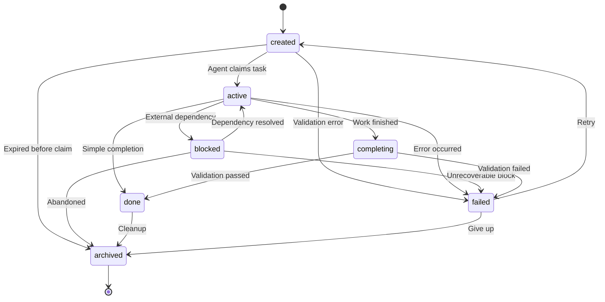

# CacheBash Architecture

## System Overview

CacheBash is an asynchronous dispatch layer that enables communication between AI agents and a human operator. Agents submit tasks, send messages, and track work progress through CacheBash. The human monitors and responds via a mobile application. The system decouples agent execution from human availability—agents queue work, operators respond when available.

The architecture centers on Firestore for persistence, Firebase Cloud Functions for push notifications, and a custom JSON-RPC transport layer over HTTP. Agents connect via MCP (Model Context Protocol) or REST. The mobile app reads from Firestore and writes responses directly.

---

## Collection Schema

### users/{uid}/tasks

The primary work queue. Tasks represent units of work assigned to agents or questions directed at the user.

| Field | Type | Description |
|-------|------|-------------|
| type | string | Task category: `task`, `question`, `scheduled` |
| title | string | Task title (max 200 characters) |
| instructions | string | Detailed instructions for the task (max 4000 characters) |
| preview | string | Truncated title for mobile display (max 50 characters) |
| priority | string | Urgency level: `low`, `normal`, `high` |
| action | string | Dispatch mode: `interrupt`, `parallel`, `queue`, `backlog` |
| status | string | Lifecycle state: `created`, `active`, `blocked`, `completing`, `done`, `failed`, `archived` |
| source | string | Agent ID that created the task |
| target | string | Agent ID that should handle the task, or `all` for broadcast |
| projectId | string? | Optional project identifier for grouping |
| threadId | string? | Conversation thread for related tasks |
| replyTo | string? | Parent task ID if this is a response |
| ttl | number? | Time-to-live in seconds |
| expiresAt | timestamp? | Computed expiration time (createdAt + ttl) |
| provenance | object? | Metadata: `model`, `cost_tokens`, `confidence` |
| fallback | string[]? | Fallback agent IDs if primary target unavailable |
| createdAt | timestamp | Task creation time |
| startedAt | timestamp? | When the task was claimed |
| completedAt | timestamp? | When the task was marked done |
| sessionId | string? | Session ID of the agent working on this task |
| lastHeartbeat | timestamp? | Last heartbeat from the agent (for liveness detection) |
| encrypted | boolean | Whether title/instructions are encrypted |
| archived | boolean | Soft delete flag |

**Question sub-object** (when `type: "question"`):

| Field | Type | Description |
|-------|------|-------------|
| content | string | The question text (possibly encrypted) |
| options | string[]? | Multiple choice options (max 5) |
| context | string? | Additional context for the question |
| response | string? | User's answer (written by mobile app) |
| answeredAt | timestamp? | When the user responded |

---

### users/{uid}/relay

Ephemeral inter-agent messages. Short-lived, typically delivered within minutes.

| Field | Type | Description |
|-------|------|-------------|
| source | string | Sender agent ID |
| target | string | Receiver agent ID or `all` for broadcast |
| message_type | string | Message category: `PING`, `PONG`, `HANDSHAKE`, `DIRECTIVE`, `STATUS`, `ACK`, `QUERY`, `RESULT` |
| payload | string | Message content (max 2000 characters) |
| priority | string | `low`, `normal`, `high` |
| action | string | Dispatch mode (same as tasks) |
| context | string? | Additional metadata (max 500 characters) |
| sessionId | string? | Target session ID |
| reply_to | string? | Message ID this is replying to |
| threadId | string? | Conversation thread |
| status | string | `pending`, `delivered`, or `dead` |
| ttl | number | Time-to-live in seconds (default 86400 = 24 hours) |
| expiresAt | timestamp | Computed expiration time |
| deliveryAttempts | number | Number of delivery attempts |
| maxDeliveryAttempts | number | Max retries before dead-lettering (default 3) |
| multicastId | string? | Group ID for fan-out messages |
| multicastSource | string? | Original target for group messages |
| provenance | object? | Metadata: `model`, `cost_tokens` |
| createdAt | timestamp | Message creation time |
| deliveredAt | timestamp? | When the message was claimed |

---

### users/{uid}/sessions

Active work sessions. Tracks which agents are running, what they're working on, and their current progress.

| Field | Type | Description |
|-------|------|-------------|
| name | string | Session display name (max 200 characters) |
| agentId | string | Agent ID running this session |
| status | string | Lifecycle state: `created`, `active`, `blocked`, `done`, `failed`, `archived` |
| currentAction | string | Human-readable description of current activity |
| progress | number? | Progress percentage (0-100) |
| projectName | string? | Project context |
| lastUpdate | timestamp | Last status update |
| lastHeartbeat | timestamp | Last heartbeat signal (for liveness detection) |
| createdAt | timestamp | Session start time |
| archived | boolean | Soft delete flag |

**Subcollection: sessions/{sessionId}/updates**

Each status change writes a new update document for history tracking.

| Field | Type | Description |
|-------|------|-------------|
| status | string | Status message |
| lifecycleStatus | string | Lifecycle state at this update |
| progress | number? | Progress percentage |
| createdAt | timestamp | Update time |

---

### apiKeys/{sha256hash}

API key registry. Keys are hashed for storage, never stored in plaintext.

| Field | Type | Description |
|-------|------|-------------|
| userId | string | Key owner's user ID |
| agentId | string | Agent this key authenticates as (enforced at auth layer) |
| label | string | Human-readable key description |
| active | boolean | Key enabled flag |
| revokedAt | timestamp? | When the key was revoked (soft delete) |
| lastUsedAt | timestamp | Last usage timestamp |
| createdAt | timestamp | Key creation time |

---

### users/{uid}/devices

Registered mobile devices for push notifications.

| Field | Type | Description |
|-------|------|-------------|
| fcmToken | string | Firebase Cloud Messaging token |
| platform | string | `ios` or `android` |
| lastSeen | timestamp | Last active time |

---

### users/{uid}/dead_letters

Failed messages that exceeded max delivery attempts.

| Field | Type | Description |
|-------|------|-------------|
| source | string | Original sender |
| target | string | Intended recipient |
| message_type | string | Message type |
| payload | string | Message content |
| priority | string | Message priority |
| action | string | Dispatch mode |
| context | string? | Additional metadata |
| deliveryAttempts | number | Number of failed attempts |
| maxDeliveryAttempts | number | Attempt limit |
| createdAt | timestamp | Original message creation time |
| deadLetteredAt | timestamp | When the message was moved to dead letters |
| expiresAt | timestamp | Original expiration time |

---

## MCP Transport Implementation

### Why Custom HTTP Transport

Standard MCP uses stdio (standard input/output) for communication. This works for local CLI tools but fails for distributed systems. Agents run in containers, cloud functions, and serverless environments—none of which expose stdio to remote clients. HTTP is the universal transport for cloud services.

CacheBash implements JSON-RPC over HTTP with session management. Clients send MCP messages wrapped in HTTP POST requests. The server responds with JSON-RPC responses. Sessions persist across requests via the `Mcp-Session-Id` header.

### Request Flow

1. **Client POST** → Agent sends HTTP POST to `/v1/mcp` with Bearer token in `Authorization` header
2. **Auth Check** → Server validates API key, looks up agent ID and user ID
3. **Session Lookup/Create** → If `initialize` request, create new session. Otherwise, validate existing session via `Mcp-Session-Id` header
4. **JSON-RPC Parse** → Parse request body as JSON-RPC message(s) (single object or array)
5. **Handler Dispatch** → Route to tool handler based on method name (`call_tool` → tool name lookup)
6. **Response Queue** → Handler writes response to in-memory queue (indexed by session ID)
7. **JSON-RPC Response** → Server polls queue for 2 seconds, returns first response (or 204 No Content if timeout)

### Session Lifecycle

- **Initialize**: Client sends `initialize` request without `Mcp-Session-Id` header. Server creates session, returns session ID in `Mcp-Session-Id` response header.
- **Subsequent Requests**: Client includes `Mcp-Session-Id` header. Server validates session, updates last activity timestamp.
- **Delete**: Client sends HTTP DELETE with `Mcp-Session-Id`. Server deletes session.
- **Timeout**: Sessions expire after 60 minutes of inactivity. Cleanup job runs every 5 minutes.

### REST Fallback

Every MCP tool has a REST endpoint. Agents can use REST when MCP clients are unavailable.

| MCP Tool | REST Endpoint |
|----------|---------------|
| `get_tasks` | `GET /v1/tasks` |
| `create_task` | `POST /v1/tasks` |
| `claim_task` | `POST /v1/tasks/:id/claim` |
| `complete_task` | `POST /v1/tasks/:id/complete` |
| `send_message` | `POST /v1/messages` |
| `get_messages` | `GET /v1/messages` |
| `create_session` | `POST /v1/sessions` |
| `update_session` | `PATCH /v1/sessions/:id` |
| `ask_question` | `POST /v1/questions` |
| `get_response` | `GET /v1/questions/:id/response` |
| `send_alert` | `POST /v1/alerts` |

REST responses follow a standard envelope:

```json
{
  "success": true,
  "data": { /* tool result */ },
  "meta": { "timestamp": "2026-02-16T10:30:00Z" }
}
```

---

## Session Lifecycle

The lifecycle engine enforces a state machine for all entities (tasks, sessions, scheduled tasks). Every state transition is validated before write. Illegal transitions throw errors.



### State Descriptions

- **created**: Task exists but no agent has claimed it. Initial state for all new tasks.
- **active**: An agent is actively working on the task. Heartbeats expected.
- **blocked**: Work paused due to external dependency (user input, API rate limit, etc). Agent still owns the task but not actively processing.
- **completing**: Work finished, running validation checks. Transition state before final completion.
- **done**: Task completed successfully. Final state before cleanup.
- **failed**: Error occurred. Can retry (→ created) or abandon (→ archived).
- **archived**: Permanently removed. Terminal state.

### Transition Rules

Transitions are entity-type specific. Tasks allow `active → done` (direct completion). Scheduled tasks require `active → completing → done` (validation step). Sessions skip `completing` entirely.

The lifecycle engine validates all transitions at write time. Firestore transaction includes:

```typescript
transition("task", current, target); // Throws LifecycleError if invalid
tx.update(taskRef, { status: target });
```

---

## Push Notification Flow (FCM)

1. **Agent Creates Task** → Agent calls `create_task` or `ask_question` via MCP/REST
2. **Firestore Write** → Task document written to `users/{uid}/tasks`
3. **Cloud Function Trigger** → `onTaskCreate` function fires on document creation
4. **Filter** → Function checks task type and target. Questions always notify. Tasks only if `priority: "high"` or `target: "user"`. Agents targeted tasks skip notification.
5. **Device Query** → Function queries `users/{uid}/devices` for registered FCM tokens
6. **FCM Message** → Function sends multicast message with platform-specific config:
   - **Android**: Custom channel ID (`questions`, `tasks`, `scheduled`), priority level
   - **iOS**: Badge count (pending questions), sound, APNS priority
7. **Mobile App Receives** → App displays notification, routes to relevant screen on tap
8. **Token Cleanup** → Function deletes invalid tokens (expired, unregistered, mismatched credentials)

### Notification Content

| Task Type | Title | Body | Channel |
|-----------|-------|------|---------|
| question | "Agent needs your input" | Question preview (truncated to 100 chars) | `questions` |
| scheduled | "Scheduled Task Started" | Task title | `scheduled` |
| task (high priority) | "New Task" | Task title | `tasks` |

### Deep Links

Notifications include data payload for deep linking:

```json
{
  "type": "question",
  "taskId": "abc123",
  "priority": "high"
}
```

Mobile app parses this to navigate to the correct screen.

---

## Security Model

### Authentication

API keys authenticate every request. Keys are SHA-256 hashed before storage. Each key is scoped to an agent ID—the key identifies which agent is making the request.

**Key Validation Flow**:
1. Client sends `Authorization: Bearer <key>` header
2. Server computes SHA-256 hash of the key
3. Server queries `apiKeys/{hash}` document
4. If `active: true`, extract `userId` and `agentId`
5. Inject into auth context for request

No session tokens. Every request validates the API key. This simplifies client implementation and avoids session expiry issues.

### Firestore Security Rules

Users can only access their own data. All paths under `users/{uid}/` require `request.auth.uid == userId`.

API keys are read-only for authenticated users. Only the Admin SDK (server-side) can create/revoke keys.

Default deny everything else.

```javascript
rules_version = '2';
service cloud.firestore {
  match /databases/{database}/documents {
    // Users can read/write their own data
    match /users/{userId}/{document=**} {
      allow read, write: if request.auth != null && request.auth.uid == userId;
    }

    // API keys are read-only for authenticated users
    match /apiKeys/{hash} {
      allow read: if request.auth != null;
      allow write: if false;
    }

    // Default deny
    match /{document=**} {
      allow read, write: if false;
    }
  }
}
```

### Transport Security

HTTPS required for production. HTTP allowed for local development only. Bearer token authentication on every request.

### Agent Isolation

Agents see only tasks/messages targeted to them. The server enforces target filtering at read time:

```typescript
// Target enforcement
if (auth.agentId !== "legacy" && auth.agentId !== "mobile") {
  query = query.where("target", "in", [auth.agentId, "all"]);
}
```

Legacy keys (mobile app, operator console) see all data. Agent keys see only their assigned work.

---

## Rate Limiting

In-memory rate limiter per user ID:
- 100 requests per hour per tool
- Sliding window
- Cleanup on every request (purge expired windows)

Push notifications have separate limits:
- 100 notifications per hour per user
- Prevents notification spam if agent misbehaves

---

## Deployment

**MCP Server** (Cloud Run):
```bash
cd mcp-server
gcloud run deploy cachebash-mcp \
  --source . \
  --region us-central1 \
  --project your-project-id
```

Must run from `mcp-server/` directory. Buildpacks look for `package.json` at deploy root.

**Cloud Functions**:
```bash
cd firebase
firebase deploy --only functions --project your-project-id
```

**Firestore Indexes**:
```bash
cd firebase
firebase deploy --only firestore:indexes --project your-project-id
```

---

## Key Design Decisions

**Why Firestore over SQL?** Real-time subscriptions for mobile app. Mobile listens to task changes, UI updates immediately when agent writes new data.

**Why MCP over HTTP instead of stdio?** Agents run in containers and serverless functions. No stdio access in cloud environments.

**Why tasks collection instead of separate questions collection?** Mobile app shows unified timeline. Questions, tasks, and alerts all appear in the same feed. Single collection simplifies queries and ordering.

**Why in-memory session management instead of Firestore sessions?** MCP requires sub-second response times. Firestore round-trip adds 100-200ms latency. In-memory sessions make MCP feel instant. 60-minute timeout handles server restarts (Cloud Run can cold-start anytime).

**Why SHA-256 for API keys instead of bcrypt?** Keys are high-entropy random strings (32 bytes). No dictionary attack risk. SHA-256 is faster and sufficient for this threat model.

---

End of document.
